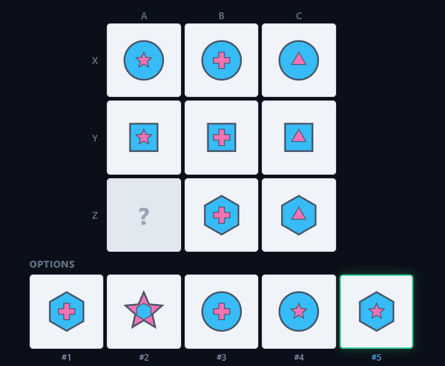
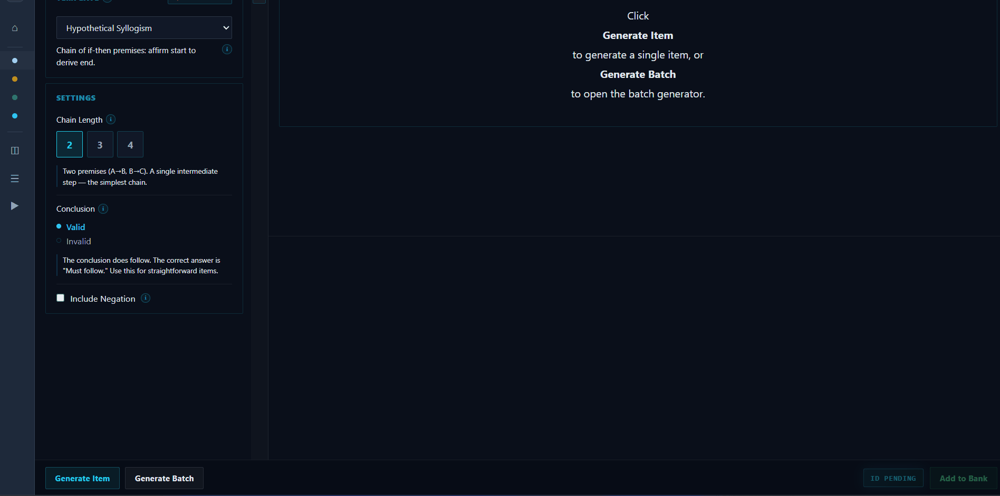
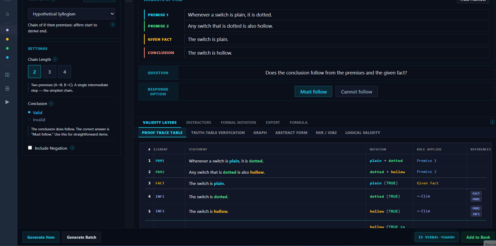
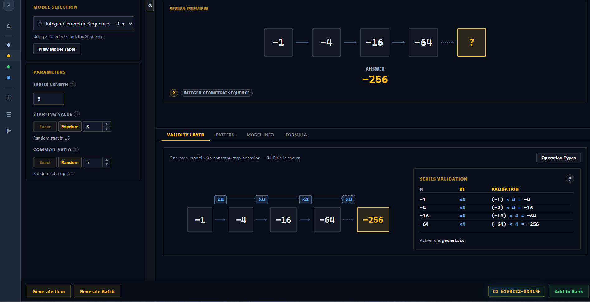
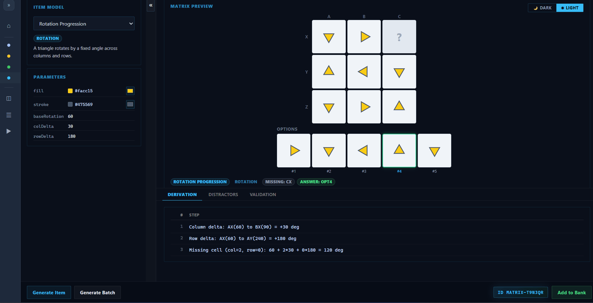
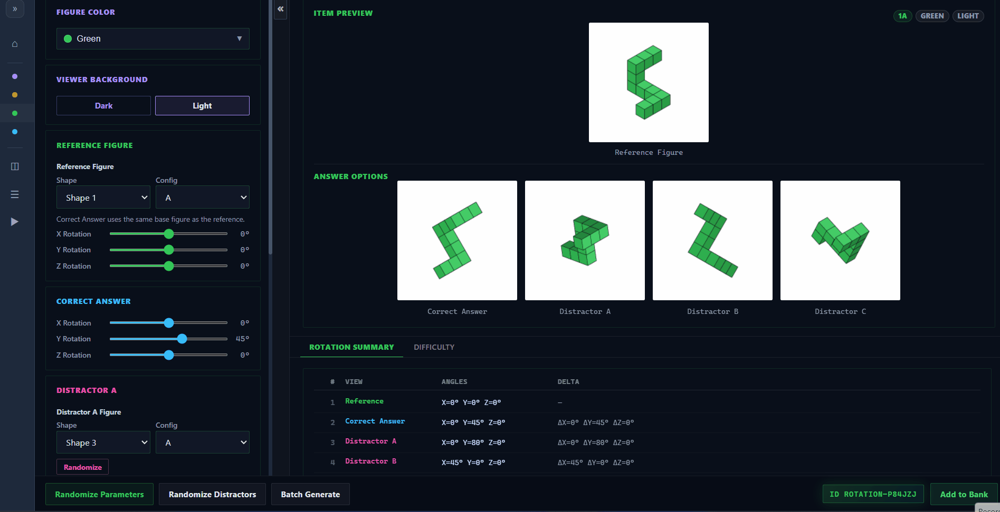
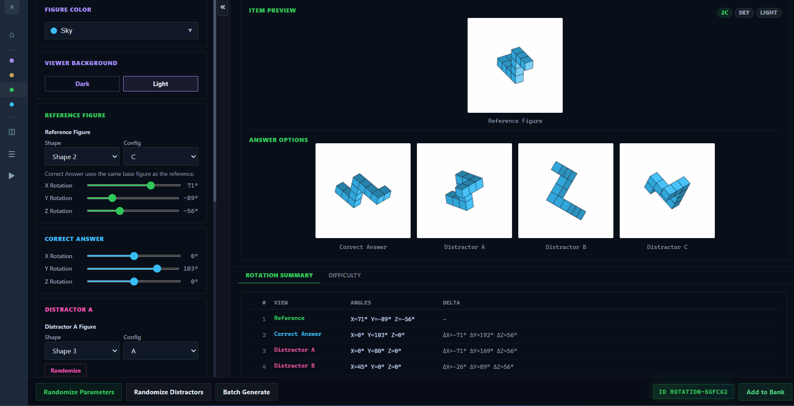

# PsychKit
**Psychometric Item Generation Toolkit**
*v0.1.0 — Experimental Build*

Developed by **Ender de Freitas** — AI & Cognitive Scientist
- **LinkedIn:** [endpsych](https://linkedin.com/in/endpsych)
- **GitHub:** [endpsych](https://github.com/endpsych)

---

## About This Tool
PsychKit currently implements four procedural item generators, each targeting a distinct cognitive construct. All generators include proof tracing methods to verify item validity and quality.

### Procedural Item Generators

* **Verbal Reasoning:** Generates syllogistic reasoning items requiring logical evaluation of premise-conclusion structures across varying argument forms.

* **Number Series:** Generates numerical sequence completion items across ten rule models, including arithmetic, geometric, recurrence, and two-step series with configurable parameters.

* **Spatial Rotation:** Generates 3D figure rotation items requiring mental rotation and the perceived rotation of objects across randomized shapes, orientations, and distractor configurations.

* **Progressive Matrices:** Generates abstract reasoning matrix items with rule-governed visual patterns across shape, color, size, and positional transformations.

### Core Features
Items can be reviewed, edited, and saved to a persistent **Item Bank**. From the bank, items can be assembled into structured tests using the **Test Builder**, which supports multi-subtest configurations with ordered item selection. Assembled tests can be administered directly through the **Take Test** module, which presents items sequentially and provides per-item and aggregate scoring upon completion.

---

## Recommended Use Cases
This tool is suitable for:
* Item prototyping and pilot generation
* Cognitive assessment methodology research
* Classroom and teaching demonstrations
* Exploration of procedural item generation approaches

---

## Data & Privacy
All data — including generated items, the item bank, and assembled tests — is stored exclusively in your browser's local storage. Nothing is transmitted to any external server. **Clearing your browser data will permanently erase all stored content.**

## Project Demos

Creating a single verbal reasoning item

Creating a batch of verbal reasoning items

Creating a single number series item

Creating a batch of number series items

Creating a single progressive matrices item

Creating a batch of progressive matrices items

Creating a single spatial rotation item

Creating a batch of spatial rotation items

Reviewing the items in the item bank

Building a test using the test builder feature

Taking a test

---

## Disclaimer & Notice of Limitations
This application is a research and development prototype built for experimental purposes. It is not intended for operational use in clinical, educational, or professional assessment contexts. Functionality is deliberately scoped and constrained; this is not a full psychometric platform.

If you need a more comprehensive, validated, or custom-built psychometric solution, the author is available for commissioned development. More advanced implementations — including full item banks, adaptive testing engines, and reporting pipelines — can be produced on request.

*This software is provided as-is, without warranty of any kind. The author bears no liability for how this application or its outputs are used, interpreted, or applied. Users are solely responsible for ensuring that any use complies with applicable standards and regulations.*

---

> &copy; 2026 Ender de Freitas. All rights reserved.
> *Experimental · Not for Operational Use*